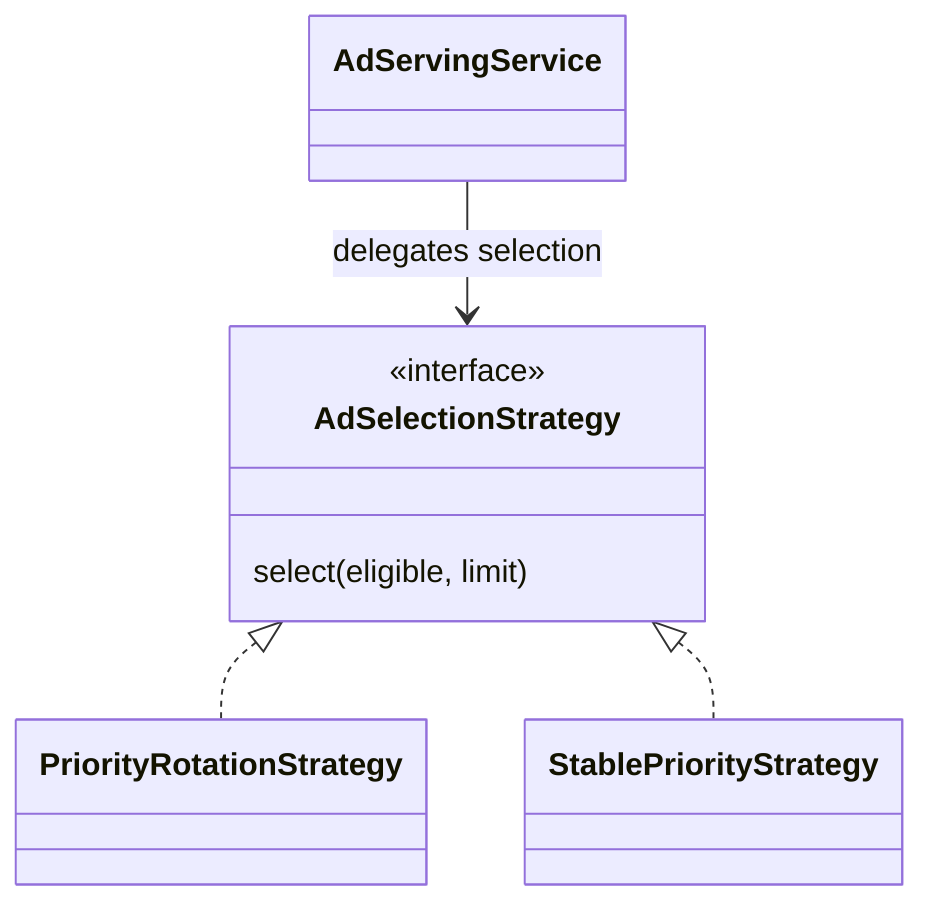

# FR5 design pattern and regression testing

FR5 uses the Strategy pattern to select advertisements. The viewer now requests
all five supported positions, and the campaign console supports saving drafts
and downloading authenticated CSV reports for a selected inclusive date range.

## Strategy implementation

| Role | Class | Responsibility |
| --- | --- | --- |
| Context | `AdServingService` | Checks playback access and subscription benefits, queries eligible placements, delegates selection, and records delivery. |
| Contract | `AdSelectionStrategy` | Selects up to the requested limit of distinct advertisements from eligible placements. |
| Default strategy | `PriorityRotationStrategy` | Orders priority bands descending and shuffles within each band. Preserves existing delivery policy. |
| Alternative strategy | `StablePriorityStrategy` | Orders priority descending and breaks ties by placement ID ascending. |
| Client/configuration | Spring dependency injection | Supplies the configured strategy to the context's constructor. |



Set `SKOPIA_AD_SELECTION=rotation` (default) or `SKOPIA_AD_SELECTION=stable`
before starting the application. Alternatively set `skopia.ads.selection` as a
Spring property. Selection is configured at startup; there is no public endpoint
that changes delivery policy. Strategy implementations are stateless because
Spring shares them across requests.

Both strategies honor limits and deduplicate by advertisement ID without
mutating the supplied list. They only choose among placements already accepted
by the repository's eligibility query. Expiry, paused campaigns, inactive ads,
targeting, slot matching, and subscription checks remain outside the algorithm.

## Viewer behavior

These timings are the implementation's delivery policy, not additional claims
about the original requirements. Each position is requested once per watch
session; an empty response continues the feature without showing a placeholder.

| Position | Trigger | Effect on the feature |
| --- | --- | --- |
| Pre-roll | Opening a playable title | Feature remains paused until the ad finishes or is skipped. |
| Lobby standee | After pre-roll, before the first Play action | Small advertising card outside the playback surface. Removed when playback starts. |
| Overlay | Playing at or beyond one quarter of the recorded duration | Small advertising card above the transport; feature continues playing. |
| Mid-roll | Playing at or beyond half of the recorded duration | Pauses the existing media element and resumes from the same position after the break. |
| Post-roll | Feature ends | Runs before the existing next-title autoplay action. |

Seeking across a threshold requests that break once. Mid-roll takes precedence
when a seek crosses both thresholds. The feature stays mounted during blocking
ads, so its position, volume, speed, captions, and fullscreen session survive.
An overlay stays mounted while temporarily hidden by a blocking ad, avoiding a
second request and impression. Player shortcuts are suspended during a blocking
break. Advertisement skipping is available after five seconds. Images complete
after eight seconds; videos complete on media end or their configured duration.
Serving errors and broken creative finish the break so advertising does not
prevent feature playback. Ad-free entitlement is enforced by the backend for
every position.

## Test report fixes

The supplied `26-MTR-SE2030-14_Testcases_Chrome_Tested.docx` was read as evidence
and left unchanged. This change addresses its FR5 findings:

- **FR5-TC02:** Save draft is available at the schedule step. Campaign and creative
  remain DRAFT until the officer switches on the creative and confirms the campaign.
- **FR5-TC10:** CSV is fetched with the existing bearer-authenticated blob helper,
  then downloaded through a temporary object URL. Tokens are never added to URLs.
  Date filters drive both displayed metrics and CSV. Summary metrics use the same
  range as campaign reports, rather than mixing lifetime totals with ranged exports.
- **FR5-TC06:** Normal UI validation is tested in Chrome. Malformed both/neither
  requests cannot be constructed through that UI and are tested through the API;
  the browser report explicitly distinguishes these checks.
- **FR5-TC05:** Uploads also validate file signatures before storage, rejecting
  renamed scripts even when filename and MIME labels match. These checks identify
  supported containers; playback failure remains handled by the viewer.

## Running the checks

Use Java 17 and install frontend dependencies with `npm ci` in `frontend/`.

```sh
./mvnw test -DskipFrontend=true
npm --prefix frontend test
npm --prefix frontend run lint
npm --prefix frontend run build
```

For Chrome regression, use a disposable local H2 database. No real payment,
production account, or hosted database is involved. From the repository root:

```sh
./mvnw spring-boot:run \
  -Dspring-boot.run.useTestClasspath=true \
  -Dspring-boot.run.profiles=h2 \
  -Dspring-boot.run.arguments='--server.port=8083 --skopia.billing.demo-enabled=true --skopia.ads.media.storage-dir=/tmp/skopia-fr5-run/ads'
```

In another terminal:

```sh
npm --prefix frontend run test:fr5
```

The runner requires Playwright (`npm install --no-save playwright`, or set
`PLAYWRIGHT_MODULE` to an existing bundled Playwright module). It uses installed
Google Chrome on macOS by default; set `CHROME_PATH`
for another installation. `ffmpeg` must be available to generate the 24-second
feature fixture. It creates fixture media automatically when absent. Optional
variables: `SKOPIA_BASE_URL` (loopback only), `FR5_HEADLESS=true`,
`FR5_MEDIA_DIR`, `FR5_EVIDENCE_DIR`, and `PLAYWRIGHT_MODULE` for a bundled runtime.

The runner creates fresh users and media as API preconditions. It then signs in,
uploads ads, creates and saves campaigns, chooses targets and slots, plays and
skips advertisements, clicks promotional links, changes campaign state, edits
creative and placements, filters performance, downloads CSV, and activates a
synthetic subscription through actual browser controls. Browser API responses
are real; only the explicit outage and broken-media scenarios inject network
failures. Screenshots, downloaded CSV, and structured results are written to
`output/fr5-regression/`. Repeated runs add fixture records until H2 is restarted.

This is a focused FR5 browser regression plus the full repository automated
suite; it does not claim to fix unrelated FR1–FR6 failures in the source report.
